# LLM-Driven Workflow Architecture
## Smart Contract Testing MCP Server

### Overview

This document describes the **LLM-Driven Workflow Architecture** implemented in the Smart Contract Testing MCP Server. This architecture replaces rule-based conditional logic with **contextual LLM analysis** while maintaining structured guidance and quality gates.

---

## 🎯 **ARCHITECTURE PRINCIPLES**

### **1. LLM-First Analysis**
- **Domain Classification**: LLM analyzes project context to determine domain (DeFi, NFT, Governance, etc.)
- **Mock Quality Assessment**: LLM evaluates mock contract sophistication and realism
- **Context-Aware Recommendations**: LLM provides domain-specific testing strategies

### **2. Structured Workflow Integration**
- **Mandatory Analysis Points**: LLM analysis is integrated at critical workflow decision points
- **Quality Gates**: LLM scores determine workflow progression (e.g., mock sophistication >= 0.6)
- **Actionable Outputs**: LLM returns structured JSON for programmatic workflow adaptation

### **3. Contextual Intelligence**
- **Project Understanding**: LLM receives actual contract code and test content
- **Domain Expertise**: LLM applies domain-specific knowledge (DeFi security patterns, NFT standards)
- **False Positive Reduction**: LLM understands sophisticated architectures vs. poor implementations

---

## 🏗️ **WORKFLOW STRUCTURE**

### **Core Workflow Pipeline**

```mermaid
graph TD
    A[🚀 initialize_protocol_testing_agent] --> B[🎯 Domain Analysis LLM]
    B --> C[📊 Project State Analysis]
    C --> D[⚡ execute_testing_workflow]
    D --> E[🔍 AI Failure Detection]
    E --> F[🛡️ Mock Quality Gate LLM]
    F --> G[📈 Phase Progression]
    G --> H[✅ Coverage Validation]
```



### **LLM Integration Points**

#### **Point 1: Project Initialization (Step 0)**
- **Location**: `initialize_protocol_testing_agent` method
- **LLM Prompt**: `analyze-project-domain`
- **Purpose**: Domain classification and initial quality assessment
- **Impact**: Customizes entire workflow strategy

#### **Point 2: Mock Quality Gate (Phase 2)**
- **Location**: `_execute_workflow_phase` method, Phase 2
- **LLM Prompt**: `analyze-mock-sophistication`
- **Purpose**: Elite mock contract validation
- **Impact**: Blocks progression if mocks are insufficient

---

## 📋 **WORKFLOW PHASES**

### **Phase 1: Initialization & Domain Analysis**

```python
# AUTO-EXECUTED in initialize_protocol_testing_agent
async def _domain_analysis_integration():
    project_sources = await self._extract_project_sources(project_path)
    test_sources = await self._extract_test_sources(project_path)
    
    domain_analysis = await self._call_domain_analysis_prompt(
        project_sources=project_sources,
        test_sources=test_sources
    )
    
    # Results customize workflow recommendations
    session.domain_analysis = domain_analysis
```

**LLM Output Format**:
```json
{
  "primary_domain": "DeFi|NFT|Governance|Gaming|Bridge|Utility|General",
  "secondary_domains": ["string"],
  "contextual_quality_score": 0.0-1.0,
  "missing_patterns": ["domain-specific gaps"],
  "recommendations": ["actionable improvements"]
}
```

### **Phase 2: Core Testing + Mock Quality Gate**

```python
# AUTO-EXECUTED in execute_testing_workflow Phase 2
async def _mock_quality_gate():
    mock_contracts = await self._extract_mock_contracts(project_path)
    target_contracts = await self._extract_project_sources(project_path)
    
    mock_analysis = await self._call_mock_analysis_prompt(
        mock_contracts=mock_contracts,
        target_contracts=target_contracts,
        test_context="Core Unit Test Implementation"
    )
    
    # BLOCKING QUALITY GATE
    if mock_analysis["overall_sophistication_score"] < 0.6:
        # BLOCK PROGRESSION - Force mock improvements
        return {"status": "BLOCKED", "required_actions": [...]}
```

**LLM Output Format**:
```json
{
  "overall_sophistication_score": 0.0-1.0,
  "mock_analyses": [
    {
      "mock_name": "string",
      "sophistication_level": "minimal|basic|intermediate|advanced|sophisticated",
      "critical_issues": ["blocking problems"],
      "improvement_recommendations": ["specific fixes"]
    }
  ],
  "critical_gaps": ["missing capabilities"],
  "immediate_actions": ["priority fixes"]
}
```

---

## 🔧 **IMPLEMENTATION ARCHITECTURE**

### **File Organization**

```
components/
├── testing_prompts.py          # 🎯 LLM PROMPTS (NEW)
│   ├── analyze-project-domain        # Domain classification prompt
│   └── analyze-mock-sophistication   # Mock quality analysis prompt
├── testing_tools.py            # 🏗️ WORKFLOW ORCHESTRATION (ENHANCED)
│   ├── _extract_project_sources()    # Content collection for LLM
│   ├── _extract_test_sources()       # Test content extraction
│   ├── _extract_mock_contracts()     # Mock contract extraction
│   ├── _call_domain_analysis_prompt() # LLM domain analysis
│   └── _call_mock_analysis_prompt()   # LLM mock analysis
├── testing_server.py           # 🚀 MCP SERVER (UNCHANGED)
├── project_analyzer.py         # 📊 AST ANALYSIS (COMPLEMENTARY)
└── ai_failure_detector.py      # 🔍 PATTERN DETECTION (COMPLEMENTARY)
```

### **Key Integration Points**

#### **1. `testing_prompts.py` - LLM Prompt Definitions**

```python
@mcp.prompt(name="analyze-project-domain")
async def analyze_project_domain(project_sources: str, test_sources: str):
    """Domain classification and quality assessment prompt"""
    return [
        {"role": "system", "content": system_prompt},
        {"role": "user", "content": f"Analyze: {project_sources}..."}
    ]

@mcp.prompt(name="analyze-mock-sophistication") 
async def analyze_mock_sophistication(mock_contracts: str, target_contracts: str, test_context: str):
    """Elite mock contract analysis prompt"""
    return [
        {"role": "system", "content": system_prompt},
        {"role": "user", "content": f"Analyze mocks: {mock_contracts}..."}
    ]
```

#### **2. `testing_tools.py` - Workflow Integration**

```python
# Domain Analysis Integration (Step 0)
async def initialize_protocol_testing_agent():
    # ... existing project analysis ...
    
    # 🎯 NEW: Mandatory domain analysis
    domain_analysis = await self._call_domain_analysis_prompt(
        project_sources, test_sources
    )
    session.domain_analysis = domain_analysis
    
    return {
        "domain_analysis": domain_analysis,  # NEW: LLM results
        "intelligent_analysis": project_state,
        "contextual_workflows": customized_by_domain
    }

# Mock Quality Gate (Phase 2)
async def _execute_workflow_phase(phase_number=2):
    # ... existing AI failure detection ...
    
    # 🛡️ NEW: Mock sophistication quality gate
    mock_analysis = await self._call_mock_analysis_prompt(
        mock_contracts, target_contracts, test_context
    )
    
    if mock_analysis["overall_sophistication_score"] < 0.6:
        return {"status": "BLOCKED", "reason": "Mock quality insufficient"}
```

---

## 🎯 **USAGE PATTERNS**

### **For Developers Using the MCP**

#### **Standard Workflow**
```bash
# Step 1: Initialize with automatic domain analysis
initialize_protocol_testing_agent()
# → Returns domain classification and customized recommendations

# Step 2: Execute workflow with integrated quality gates
execute_testing_workflow(
    workflow_type="comprehensive",
    objectives="90% coverage with security testing"
)
# → Phase 2 includes automatic mock quality gate
```

#### **What Changes for Users**
- **Enhanced Intelligence**: Domain-aware recommendations
- **Quality Gates**: Automatic blocking on poor mock quality
- **Contextual Guidance**: Domain-specific security patterns
- **Reduced Iterations**: LLM prevents common mock failures

### **For Future Developers**

#### **Adding New LLM Analysis**
1. **Create Prompt** in `testing_prompts.py`:
```python
@mcp.prompt(name="analyze-new-aspect")
async def analyze_new_aspect(context: str):
    return [{"role": "user", "content": f"Analyze: {context}"}]
```

2. **Add Helper Method** in `testing_tools.py`:
```python
async def _call_new_analysis_prompt(self, context: str) -> Dict[str, Any]:
    # Call LLM and return structured results
```

3. **Integrate into Workflow**:
```python
# Add to appropriate phase in _execute_workflow_phase
new_analysis = await self._call_new_analysis_prompt(context)
mandatory_tool_results["new_analysis"] = new_analysis
```

#### **Quality Gate Pattern**
```python
# Standard blocking quality gate pattern
if analysis_score < threshold:
    return {
        "status": "BLOCKED",
        "reason": "Quality below threshold",
        "required_actions": analysis["immediate_actions"],
        "cannot_proceed_until": "Score >= threshold"
    }
```

---

## 🚀 **BENEFITS & IMPACT**

### **Advantages of LLM-Driven Architecture**

1. **Contextual Intelligence**
   - Understands actual code content vs. pattern matching
   - Applies domain-specific expertise automatically
   - Reduces false positives through semantic understanding

2. **Adaptive Workflows**
   - DeFi projects get DeFi-specific guidance
   - Mock quality gates prevent false test confidence
   - Domain-aware security recommendations

3. **Maintainable Codebase**
   - Replaces complex conditional logic with prompts
   - Centralizes domain expertise in LLM prompts
   - Easier to update and enhance

4. **Elite Quality Assurance**
   - Mock sophistication prevents common failures
   - Domain classification ensures appropriate patterns
   - Quality gates block progression until standards met

### **Performance Characteristics**

- **Initialization**: +2-3 seconds for domain analysis
- **Phase 2**: +3-5 seconds for mock analysis quality gate
- **Overall**: Significantly reduces testing iterations through early quality gates

---

## 📊 **METRICS & MONITORING**

### **Quality Gate Success Metrics**
- **Mock Sophistication Score**: Target >= 0.6
- **Domain Classification Accuracy**: Manual validation recommended
- **False Positive Reduction**: Track compared to rule-based approach

### **Workflow Effectiveness**
- **Iteration Reduction**: Measure test fix cycles before/after
- **Coverage Achievement**: Track time to reach coverage targets
- **Security Gap Detection**: Domain-specific vulnerability coverage

---

## 🔮 **FUTURE ENHANCEMENTS**

### **Planned LLM Integration Points**
1. **Security Pattern Analysis**: LLM-driven vulnerability detection
2. **Test Strategy Optimization**: LLM recommendations for test prioritization  
3. **Code Quality Assessment**: LLM evaluation of test effectiveness
4. **Performance Optimization**: LLM-guided test performance improvements

### **Architecture Evolution**
- **Multi-LLM Pipeline**: Specialized models for different analysis types
- **Continuous Learning**: Feedback loops to improve prompts
- **Custom Domain Models**: Fine-tuned models for specific Web3 domains

---

## 📚 **REFERENCES**

- **Main Implementation**: `components/testing_tools.py` (lines 3443-3600+)
- **LLM Prompts**: `components/testing_prompts.py` (lines 290-400+)
- **Integration Examples**: See Phase 2 execution in `_execute_workflow_phase`
- **Quality Gates**: Mock sophistication scoring in Phase 2

---

*This architecture represents a fundamental shift from rule-based to AI-driven workflow orchestration while maintaining the structured guidance and quality assurance that makes the MCP effective.* 