# Foundry Testing MCP - Executive Technical Presentation

*Intelligent Smart Contract Testing Through Model Context Protocol Integration*

---

## Slide 1: Strategic Benefits and Implementation Risks

### Core Benefits

**🎯 Deterministic Analysis Without Dependencies**
- Regex-first contract classification ensures consistent results across all development environments
- Eliminates external compiler dependencies that create analysis failures
- Provides reliable risk assessment and contract type detection regardless of toolchain setup

**🛡️ AI Quality Assurance and Failure Prevention**
- Detects 8 categories of AI-generated test failures before they compromise security
- Prevents false confidence from circular logic, mock cheating, and insufficient coverage
- Reduces testing technical debt through systematic quality validation

**⚡ Systematic Implementation with Professional Templates**
- Structured workflow guidance adapts to current project maturity levels
- Context-aware mock generation reduces debugging cycles and integration issues
- Template-driven approach ensures consistent testing patterns across development teams

### Implementation Risks

**🔧 Environment-Dependent Feature Limitations**
- Coverage analysis requires subprocess execution permissions (may fail in containerized environments)
- Directory auto-detection depends on MCP client configuration (manual setup may be required)
- AST enhancement needs Solidity compiler installation (graceful regex fallback available)

**📊 Analysis Scope Boundaries**
- Pattern recognition optimized for common DeFi/governance/token contracts (custom patterns may require adaptation)
- Performance scaling considerations for projects exceeding 100+ contracts
- Integration complexity varies across different MCP client implementations

**🔄 Workflow Integration Dependencies**
- Foundry toolchain version compatibility requirements for full feature access
- Team adoption curve for template-based testing methodology
- Initial configuration overhead for complex multi-project development environments

---

## Slide 2: AI Failure Detection - Quality Assurance System

### Comprehensive Test Quality Validation

**🔍 Critical Logic Failures**
- **Circular Logic Detection**: Identifies tests validating contracts against their own implementation
- **Always-Passing Test Prevention**: Catches assertions that provide no meaningful validation
- **Implementation Dependency Issues**: Prevents tests coupled to specific implementation details

**🎭 Mock and Simulation Quality**
- **Mock Cheating Prevention**: Detects mocks that always return expected values without realistic failure scenarios
- **Insufficient Randomization**: Identifies fuzz tests with predictable or overly constrained inputs

**🛡️ Security and Coverage Gaps**
- **Missing Security Scenarios**: Flags absence of attack vector testing (reentrancy, flash loans, price manipulation)
- **Inadequate Edge Case Coverage**: Identifies missing boundary value and error condition testing
- **Negative Test Deficiency**: Ensures proper error handling and failure scenario validation

### Technical Implementation
- **Dual Analysis Approach**: AST-based semantic analysis with regex fallback for environment independence
- **Severity Classification**: Automated risk scoring (low/medium/high/critical) with specific remediation guidance
- **Context-Aware Detection**: Reduces false positives through intelligent pattern matching

---

## Slide 3: Template System and Context-Aware Architecture

### Production Template Portfolio

**📋 Comprehensive Template Coverage**
- **Unit Test Template**: Function-level testing with comprehensive edge cases and access control verification
- **Integration Test Template**: Multi-contract workflow testing and cross-contract interaction validation
- **Invariant Test Template**: Property-based testing using Handler patterns for system-wide verification
- **Helper Utility Template**: Shared testing utilities with standardized account setup and data generation

### Context-Aware Placeholder System

**🔧 Dynamic Substitution Engine**
```
{{CONTRACT_NAME}} → ProjectToken
{{FUNCTION_NAME}} → transfer
{{MOCK_TYPE}} → MockPriceOracle
{{SECURITY_PATTERN}} → ReentrancyGuard
```

**🎯 Enhanced Mock Context Detection**
- **ERC Interface Compatibility**: Automatic detection of ERC20/721 requirements with exact signature mapping
- **AccessControl Variant Awareness**: Prevents incompatible function calls (e.g., getRoleMemberCount() errors)
- **UUPS Pattern Safety**: Avoids direct upgradeTo() calls in proxy contract testing
- **Circular Dependency Prevention**: Helper function duplication detection and resolution

### Implementation Intelligence
- **Contract-Type-Specific Guidance**: DeFi contracts receive different template recommendations than governance systems
- **Risk-Based Prioritization**: High-risk contracts get enhanced security testing template integration
- **First-Pass Success Optimization**: Reduces debugging cycles through intelligent mock generation

---

## Slide 4: Foundry Adapter - Professional Toolchain Integration

### Real CLI Integration and Output Processing

**⚙️ Direct Command Execution**
- Executes actual `forge test`, `forge coverage`, and `forge build` commands with comprehensive parameter handling
- Multi-format coverage parsing (LCOV, summary, JSON) with intelligent fallback mechanisms
- Professional error handling and subprocess management for reliable cross-platform operation

**📊 Enhanced Coverage Analysis**
- Context-aware feedback system recognizes achievement levels (90%+ coverage receives production-ready guidance)
- Gap identification with specific uncovered code sections and targeted improvement recommendations
- Professional standards differentiation between development (70%+) and production (90%+) coverage thresholds

### Project Structure Intelligence

**🏗️ Foundry Configuration Management**
- Comprehensive foundry.toml parsing with profile detection and dependency analysis
- Project structure validation ensuring proper src/, test/, and script/ directory organization
- Remapping resolution and dependency tracking for complex multi-contract architectures

**🔍 Environment Diagnostics and Troubleshooting**
- Advanced directory detection with MCP client/server alignment validation
- Environment variable resolution (MCP_CLIENT_CWD, MCP_PROJECT_PATH) for seamless integration
- Automated Foundry installation verification with version compatibility checking

---

## Slide 5: New Protocol Development Workflow

### Systematic Testing Implementation for Novel Smart Contracts

```mermaid
graph TD
    A["🚀 Developer Initiates<br/>New Protocol Testing"] --> B["📊 initialize_protocol_testing_agent"]
    B --> C["🔍 Regex-First Contract Analysis<br/>• DeFi/Governance/Token Classification<br/>• Risk Scoring & Security Patterns<br/>• Mock Requirements Detection"]
    C --> D["📋 Intelligent Workflow Selection<br/>• create_foundational_suite<br/>• Contract-type-specific guidance<br/>• Template recommendations"]
    D --> E["⚡ execute_testing_workflow<br/>Phase 1: Basic Infrastructure<br/>Phase 2: Core Functionality<br/>Phase 3: Security Testing<br/>Phase 4: Advanced Validation"]
    E --> F["📝 Template-Based Implementation<br/>• Unit/Integration/Invariant Templates<br/>• Context-aware mock generation<br/>• Security pattern integration"]
    F --> G["📈 Progress Monitoring<br/>analyze_current_test_coverage<br/>Real Foundry coverage analysis"]
    G --> H["✅ Production-Ready<br/>Testing Suite"]
    
    E --> I["🛡️ AI Failure Detection<br/>Continuous quality validation"]
    I --> F
    
    style A fill:#e1f5fe
    style H fill:#e8f5e8
    style C fill:#fff3e0
    style I fill:#fce4ec
```



**Key Value Propositions:**
- **Zero-Dependency Analysis**: Reliable contract classification without external compiler requirements
- **Systematic Guidance**: Phase-based implementation prevents overwhelm and ensures comprehensive coverage
- **Quality Assurance**: Continuous AI failure detection maintains professional testing standards
- **Accelerated Development**: Template-driven approach reduces time-to-production-ready testing

---

## Slide 6: Existing Project Enhancement Workflow

### Systematic Test Suite Improvement for Production Readiness

```mermaid
graph TD
    A["🔧 Developer Assesses<br/>Existing Project"] --> B["📊 analyze_project_context<br/>• Testing maturity classification<br/>• AI failure pattern detection<br/>• Security gap identification"]
    B --> C["🎯 Prioritized Improvement Plan<br/>• Contract-specific risk scoring<br/>• Quality issue remediation<br/>• Coverage gap analysis"]
    C --> D["🚨 Critical Issue Resolution<br/>• Fix circular logic patterns<br/>• Address mock cheating<br/>• Eliminate always-passing tests"]
    D --> E["⚡ execute_testing_workflow<br/>expand_test_coverage<br/>• Security testing enhancement<br/>• Edge case expansion<br/>• Integration scenario addition"]
    E --> F["🔄 Template Integration<br/>• Refactor existing tests<br/>• Add missing test categories<br/>• Implement helper utilities"]
    F --> G["📈 Validation & Quality Assurance<br/>• Coverage target achievement<br/>• AI failure re-detection<br/>• Production readiness assessment"]
    G --> H["🏆 Audit-Ready<br/>Testing Suite"]
    
    B --> I["🛡️ AI Failure Detection<br/>8 failure pattern analysis"]
    I --> D
    
    style A fill:#e1f5fe
    style H fill:#e8f5e8
    style D fill:#ffebee
    style I fill:#fce4ec
```



**Strategic Enhancement Approach:**
- **Quality-First Remediation**: Address existing AI failures before expanding coverage
- **Risk-Based Prioritization**: Focus improvement efforts on high-risk contracts first
- **Systematic Template Migration**: Gradual refactoring using professional testing patterns
- **Measurable Progress Tracking**: Real Foundry coverage analysis validates improvement effectiveness

---

*Technical architecture designed for executive decision-making with clear ROI through systematic testing quality improvement and risk mitigation.* 