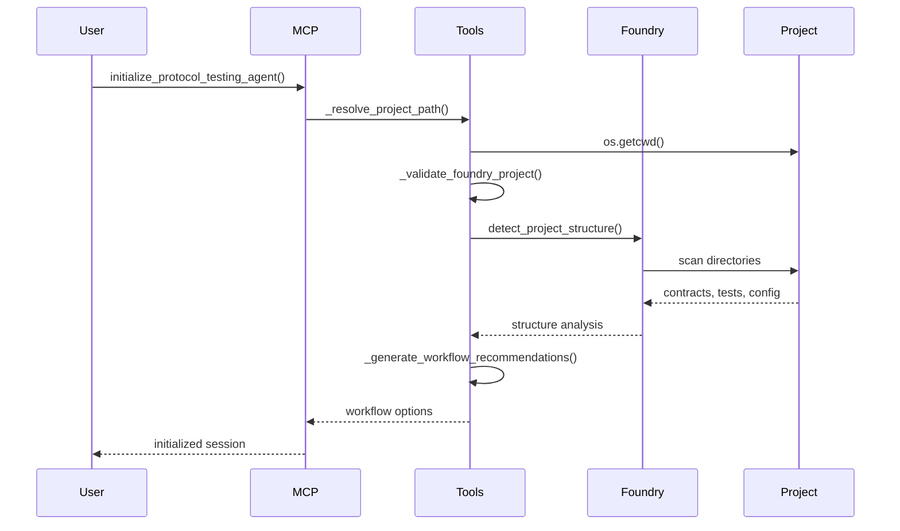
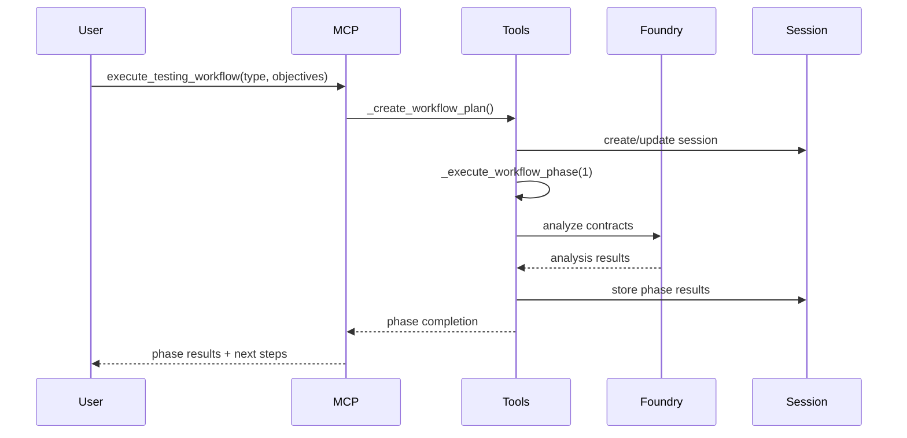
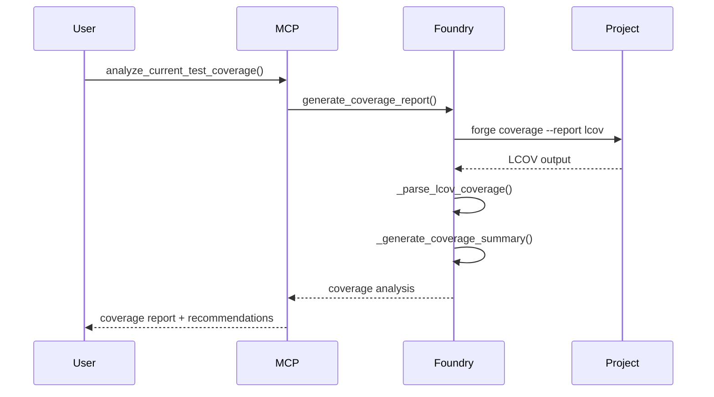

# Foundry Testing MCP - Technical Architecture Guide

## Overview

The Foundry Testing MCP (Model Context Protocol) server is a sophisticated AI-powered testing framework designed to revolutionize smart contract testing workflows. This document provides comprehensive technical documentation for engineering teams responsible for maintaining, extending, and deploying the system.

## System Architecture

### High-Level Architecture

```
┌─────────────────────────────────────────────────────────────┐
│                    MCP Client (Cursor/Claude)               │
└─────────────────────┬───────────────────────────────────────┘
                      │ MCP Protocol (stdio/http)
┌─────────────────────▼───────────────────────────────────────┐
│                 TestingMCPServer                            │
│  ┌─────────────┬─────────────┬─────────────┬─────────────┐  │
│  │TestingTools │TestingRes.. │TestingPro.. │FoundryAda.. │  │
│  │             │             │             │             │  │
│  │ • Workflows │ • Templates │ • AI Prompts│ • CLI Integ │  │
│  │ • Sessions  │ • Docs      │ • Analysis  │ • Coverage  │  │
│  │ • Analysis  │ • Resources │ • Guidance  │ • Testing   │  │
│  └─────────────┴─────────────┴─────────────┴─────────────┘  │
└─────────────────────┬───────────────────────────────────────┘
                      │ Direct CLI calls
┌─────────────────────▼───────────────────────────────────────┐
│              Foundry Toolchain                              │
│  forge test | forge coverage | forge build | cast | anvil  │
└─────────────────────────────────────────────────────────────┘
```

### Core Components

#### 1. TestingMCPServer (`components/testing_server.py`)

**Purpose**: Main FastMCP server orchestrating all components

**Key Responsibilities**:
- Server initialization and configuration management
- Component registration and lifecycle management
- Transport mode handling (stdio/http)
- Error handling and logging coordination

**Configuration System**:
```python
{
    "server": {
        "host": "127.0.0.1",
        "port": 8002,
        "transport_mode": "stdio"
    },
    "foundry": {
        "profile": "default",
        "max_fuzz_runs": 10000,
        "invariant_runs": 256
    },
    "testing": {
        "coverage_target": 90,
        "enable_gas_optimization": true
    },
    "workflow": {
        "default_project_path": ".",
        "auto_detect_project_type": true,
        "validate_foundry_project": true
    }
}
```

#### 2. FoundryAdapter (`components/foundry_adapter.py`)

**Purpose**: Deep integration with Foundry CLI toolchain

**Architecture Pattern**: Adapter Pattern
- Abstracts Foundry CLI complexity
- Provides async command execution
- Handles output parsing and error management

**Key Methods**:
```python
async def run_tests(project_path="", test_pattern="", coverage=False, gas_report=False)
async def generate_coverage_report(project_path="", format="lcov")
async def run_invariant_tests(project_path="", contract_name="")
async def analyze_gas_usage(project_path="", function_name="")
async def detect_project_structure(project_path="")
```

**Command Execution Pipeline**:
1. Path resolution (`_resolve_project_path()`)
2. Command construction with parameters
3. Async subprocess execution
4. Output parsing (JSON/LCOV/text)
5. Result aggregation and analysis

**Error Handling Strategy**:
- Graceful degradation for missing Foundry installation
- Detailed error context with troubleshooting suggestions
- Command execution timeouts and resource management

#### 3. TestingTools (`components/testing_tools.py`)

**Purpose**: Interactive workflow orchestration and session management

**Design Pattern**: Command Pattern with State Management

**Core Workflows**:

1. **Project Initialization Flow**:
   ```python
   initialize_protocol_testing_agent() →
   _validate_foundry_project() →
   _analyze_project_structure() →
   _generate_workflow_recommendations()
   ```

2. **Multi-Phase Testing Execution**:
   ```python
   execute_testing_workflow() →
   _create_workflow_plan() →
   _execute_workflow_phase() →
   [Phase 1-4 execution with deliverables]
   ```

**Session Management**:
```python
class TestingSession:
    session_id: str           # UUID for session tracking
    project_path: str         # Absolute path to project
    current_phase: int        # Workflow phase tracker
    workflow_type: str        # "create_new_suite" | "evaluate_existing"
    workflow_state: Dict      # Phase results and progress
    generated_tests: List     # Test files created
    analysis_results: Dict    # Coverage and analysis data
```

**Validation System**:
- Project type detection (Foundry/Hardhat/Truffle)
- Directory structure validation
- Foundry installation verification
- Contract and test file discovery

#### 4. TestingResources (`components/testing_resources.py`)

**Purpose**: MCP resource management for templates and documentation

**Resource Architecture**:
```
MCP Server Resources:
├── testing/foundry-patterns      # Best practices and patterns
├── testing/templates/{type}      # Test templates by type
├── testing/project-analysis      # Current project analysis
├── testing/coverage-report       # Live coverage data
├── testing/documentation         # Comprehensive guides
└── testing/templates             # Available template list
```

**Template System**:
- **Built-in templates**: Embedded in code for reliability
- **File-based templates**: External `.sol` files in `templates/`
- **Dynamic loading**: Falls back to built-in if files missing
- **Template types**: unit, integration, invariant, fuzz, security

**Resource Loading Strategy**:
1. Server path resolution (`_get_server_root()`)
2. Current project path detection (`_get_current_project_path()`)
3. Template precedence: File-based → Built-in → Default
4. Error handling with graceful fallbacks

#### 5. TestingPrompts (`components/testing_prompts.py`)

**Purpose**: AI-guided analysis and strategy development

**Prompt Categories**:
- **Contract Analysis**: `analyze-contract-for-testing`
- **Strategy Design**: `design-test-strategy` 
- **Coverage Review**: `review-test-coverage`
- **Security Testing**: `design-security-tests`
- **Performance Optimization**: `optimize-test-performance`

**Prompt Engineering Approach**:
- Structured system prompts for consistent AI behavior
- Context-aware user prompts with specific project data
- Multi-step guidance with actionable recommendations
- Integration with tool outputs for data-driven advice

## Data Flow Architecture

### 1. Initialization Flow



### 2. Testing Workflow Execution



### 3. Coverage Analysis Flow



## Technical Implementation Details

### Async/Await Pattern

The entire system is built on Python's asyncio framework for non-blocking operations:

```python
async def _run_command(self, command: List[str], cwd: str = None) -> Tuple[int, str, str]:
    process = await asyncio.create_subprocess_exec(
        *command,
        stdout=asyncio.subprocess.PIPE,
        stderr=asyncio.subprocess.PIPE,
        cwd=cwd
    )
    stdout, stderr = await process.communicate()
    return (process.returncode, stdout.decode('utf-8'), stderr.decode('utf-8'))
```

**Benefits**:
- Non-blocking CLI command execution
- Concurrent operation support
- Responsive user experience
- Resource efficiency

### Error Handling Strategy

**Hierarchical Exception System**:
```python
FoundryError (base)
├── FoundryNotFoundError     # Installation issues
├── FoundryProjectError      # Project structure issues
└── FoundryExecutionError    # Runtime execution issues
```

**Error Recovery Patterns**:
1. **Graceful Degradation**: Partial functionality when components fail
2. **Contextual Guidance**: Specific troubleshooting based on error type
3. **Validation Gates**: Early detection and prevention
4. **Resource Cleanup**: Proper cleanup on failure paths

### Path Resolution System

**Challenge**: Separate MCP server installation from target projects

**Solution**: Dual path resolution
```python
def _get_server_root(self) -> Path:
    # MCP server installation directory
    current_file = Path(__file__)
    return current_file.parent.parent.resolve()

def _get_current_project_path(self) -> Path:
    # User's working project directory
    return Path.cwd()
```

**Use Cases**:
- Templates load from server installation
- Project analysis works on current directory
- Session management tracks project switches

### Configuration Management

**Multi-Layer Configuration**:
1. **Environment Variables**: Runtime overrides
2. **Default Values**: Embedded fallbacks
3. **Validation**: Type checking and constraints
4. **Dynamic Updates**: Session-specific modifications

```python
def _load_default_config(self) -> Dict[str, Any]:
    return {
        "server": {
            "host": os.getenv("MCP_SERVER_HOST", "127.0.0.1"),
            "port": int(os.getenv("MCP_SERVER_PORT", "8002")),
            "transport_mode": os.getenv("MCP_TRANSPORT_MODE", "stdio").lower()
        }
    }
```

## Testing Strategy

### Unit Testing Approach

**Test Coverage Areas**:
- Component initialization and configuration
- Path resolution logic
- Command execution and parsing
- Error handling and recovery
- Session management operations

**Mock Strategy**:
```python
# Mock Foundry CLI for testing
@patch('components.foundry_adapter.asyncio.create_subprocess_exec')
async def test_run_tests_success(mock_subprocess):
    # Test successful test execution
    mock_process = AsyncMock()
    mock_process.returncode = 0
    mock_process.communicate.return_value = (b'test output', b'')
    mock_subprocess.return_value = mock_process
    
    adapter = FoundryAdapter()
    result = await adapter.run_tests()
    
    assert result["success"] is True
```

### Integration Testing

**Test Scenarios**:
- End-to-end workflow execution
- Multi-project session handling
- Template loading and generation
- Coverage analysis accuracy

### Performance Testing

**Benchmarks**:
- Command execution latency
- Memory usage under load
- Session management scalability
- Template generation speed

## Deployment Architecture

### MCP Client Integration (Production)

**For MCP clients like Cursor, Claude Desktop, use `run_clean.py`:**

```bash
# MCP client integration - silent protocol communication
python run_clean.py
```

**Key Features of `run_clean.py`:**
- **Silent Operation**: No stdout/stderr interference with MCP protocol
- **Error Logging**: Errors logged to `/tmp/mcp_server_error.log` instead of console
- **Optimized for MCP**: Designed specifically for MCP protocol communication
- **Graceful Shutdown**: Handles KeyboardInterrupt and exceptions silently

**MCP Client Configuration:**
```json
{
  "mcpServers": {
    "foundry-testing": {
      "command": "/path/to/foundry-testing-mcp/venv/bin/python",
      "args": ["/path/to/foundry-testing-mcp/run_clean.py"],
      "env": {
        "MCP_TRANSPORT_MODE": "stdio"
      }
    }
  }
}
```

### Local Development Setup

**For development and debugging, use `run.py`:**

```bash
# Development version with full logging and output
python run.py

# With debug logging
LOG_LEVEL=DEBUG python run.py

# HTTP mode for debugging
MCP_TRANSPORT_MODE=http python run.py
```

**Development Features:**
- **Verbose Logging**: Full console output and logging
- **Startup Banner**: Visual confirmation of server startup
- **Debug Information**: Component registration details
- **Error Details**: Full stack traces and error context

### Architecture Comparison

| Feature | `run_clean.py` | `run.py` |
|---------|----------------|----------|
| **Target** | MCP clients | Development |
| **Protocol** | MCP stdio only | MCP stdio/http |
| **Logging** | Silent (file only) | Full console |
| **Startup** | Instant | With banner |
| **Debugging** | Error file | Full traces |
| **Use Case** | Production integration | Local development |

### Production Deployment

**Docker Container for MCP Integration:**
```dockerfile
FROM python:3.11-slim

# Install system dependencies
RUN apt-get update && apt-get install -y \
    curl \
    git \
    && rm -rf /var/lib/apt/lists/*

# Install Foundry
RUN curl -L https://foundry.paradigm.xyz | bash
ENV PATH="/root/.foundry/bin:${PATH}"
RUN foundryup

# Copy and install MCP server
COPY . /app
WORKDIR /app
RUN pip install -r requirements.txt

# Use clean runner for production
CMD ["python", "run_clean.py"]
```

**systemd Service for MCP Integration:**
```ini
[Unit]
Description=Foundry Testing MCP Server
After=network.target

[Service]
Type=simple
User=mcp
WorkingDirectory=/opt/foundry-testing-mcp
ExecStart=/opt/foundry-testing-mcp/venv/bin/python run_clean.py
Restart=always
RestartSec=10
StandardOutput=null
StandardError=journal

[Install]
WantedBy=multi-user.target
```

### Environment Configuration

**MCP Client Environment Variables:**
```bash
# Required: Transport mode for MCP protocol
export MCP_TRANSPORT_MODE=stdio

# Optional: Server configuration
export MCP_SERVER_HOST=127.0.0.1
export MCP_SERVER_PORT=8002

# Optional: Foundry configuration
export FOUNDRY_PROFILE=default
export MAX_FUZZ_RUNS=10000
export INVARIANT_RUNS=256

# Optional: Testing configuration
export COVERAGE_TARGET=90
export ENABLE_GAS_OPTIMIZATION=true
```

**Development Environment Variables:**
```bash
# Development logging
export LOG_LEVEL=DEBUG
export LOG_FORMAT=console

# Development server options
export MCP_TRANSPORT_MODE=http  # For HTTP debugging
export MCP_SERVER_PORT=8002

# Development Foundry settings
export FOUNDRY_PROFILE=development
export MAX_FUZZ_RUNS=1000  # Faster for development
```

## Server Startup Patterns

### MCP Client Startup (`run_clean.py`)

```python
async def main():
    """Clean main entry point for MCP protocol."""
    # Setup silent logging first
    setup_silent_logging()
    
    # Load environment silently
    load_environment_silent()
    
    # Set MCP transport mode to stdio
    os.environ["MCP_TRANSPORT_MODE"] = "stdio"
    
    try:
        # Import and run server
        from components.testing_server import TestingMCPServer
        
        # Create and run server
        server = TestingMCPServer()
        await server.run_server()
        
    except Exception as e:
        # Log errors to file, not console
        with open("/tmp/mcp_server_error.log", "w") as f:
            f.write(f"Server error: {e}\n{traceback.format_exc()}")
        sys.exit(1)
```

### Development Startup (`run.py`)

```python
async def main():
    """Development entry point with full logging."""
    print_banner()
    setup_logging()
    
    if not check_dependencies():
        sys.exit(1)
    
    load_environment()
    
    try:
        from components.testing_server import main as server_main
        
        print("🔄 Initializing Smart Contract Testing MCP Server...")
        print("📡 Starting server...")
        
        await server_main()
        
    except KeyboardInterrupt:
        print("\n👋 Server shutdown requested by user")
    except Exception as e:
        logging.error(f"Server error: {e}")
        print(f"❌ Server error: {e}")
        sys.exit(1)

## Monitoring and Observability

### Logging Strategy

**Structured Logging**:
```python
import logging
import json

class JSONFormatter(logging.Formatter):
    def format(self, record):
        log_entry = {
            'timestamp': self.formatTime(record),
            'level': record.levelname,
            'component': record.name,
            'message': record.getMessage(),
            'session_id': getattr(record, 'session_id', None)
        }
        return json.dumps(log_entry)
```

**Log Categories**:
- **Server Operations**: Startup, shutdown, configuration
- **Tool Execution**: Workflow progress, phase completion
- **Foundry Integration**: Command execution, parsing results
- **Error Tracking**: Exception details, recovery actions
- **Performance Metrics**: Execution times, resource usage

### Metrics Collection

**Key Performance Indicators**:
- Average workflow completion time
- Test generation success rate
- Coverage improvement percentage
- Error rate by component
- Session duration and switching frequency

### Health Checks

**Health Check Endpoints**:
```python
@mcp.tool(name="health_check")
async def health_check() -> Dict[str, Any]:
    return {
        "status": "healthy",
        "foundry_installation": await self.foundry_adapter.check_foundry_installation(),
        "active_sessions": len(self.testing_tools.active_sessions),
        "server_uptime": self.get_uptime(),
        "memory_usage": self.get_memory_usage()
    }
```

## Security Considerations

### Input Validation

**Command Injection Prevention**:
- Whitelist allowed Foundry commands
- Sanitize file paths and project names
- Validate user input parameters

```python
def _validate_command_args(self, args: List[str]) -> bool:
    allowed_commands = ['test', 'coverage', 'build', 'config']
    return args[0] in allowed_commands and all(
        self._is_safe_arg(arg) for arg in args[1:]
    )
```

### File System Security

**Path Traversal Protection**:
```python
def _resolve_project_path(self, project_path: str = "") -> str:
    if not project_path:
        project_path = os.getcwd()
    
    resolved = Path(project_path).resolve()
    
    # Prevent path traversal
    if not str(resolved).startswith('/allowed/workspace/'):
        raise SecurityError("Path traversal detected")
    
    return str(resolved)
```

### Process Isolation

**Subprocess Security**:
- Use absolute paths for executables
- Set resource limits for subprocess execution
- Implement execution timeouts
- Monitor subprocess behavior

## Maintenance Guidelines

### Code Maintenance

**Code Quality Standards**:
- Type hints for all public methods
- Comprehensive docstrings (Google style)
- 90%+ test coverage requirement
- Linting with flake8, black, mypy

**Dependency Management**:
- Pin dependency versions in requirements.txt
- Regular security updates
- Compatibility testing with new versions
- Deprecation warning monitoring

### Database Migrations

**Session Storage Evolution**:
```python
class SessionMigration:
    def migrate_v1_to_v2(self, session_data: Dict) -> Dict:
        # Add new fields, transform existing data
        session_data['created_at'] = time.time()
        session_data['version'] = 2
        return session_data
```

### Performance Optimization

**Optimization Targets**:
- Command execution parallelization
- Template caching strategies
- Session data compression
- Memory usage optimization

### Troubleshooting Guide

**Common Issues**:

1. **Foundry Not Found**:
   - Check PATH environment variable
   - Verify installation with `forge --version`
   - Install Foundry using official installer

2. **Project Validation Failures**:
   - Ensure foundry.toml exists
   - Check directory structure (src/, test/)
   - Verify working directory

3. **Coverage Generation Issues**:
   - Ensure tests exist and pass
   - Check forge coverage command availability
   - Verify contract compilation success

4. **Session Management Issues**:
   - Clear stale sessions periodically
   - Monitor memory usage growth
   - Implement session timeout policies

## Extension Points

### Adding New Testing Types

**Template Extension**:
```python
# Add new template type
async def _get_performance_test_template(self) -> str:
    return """
    // Performance test template
    contract PerformanceTest is Test {
        function testGasUsage() public {
            // Performance testing logic
        }
    }
    """

# Register in template map
template_map = {
    "unit": "test_contract_template.sol",
    "integration": "integration_test_template.sol",
    "performance": "performance_test_template.sol"  # New
}
```

### Custom Workflow Phases

**Phase Extension**:
```python
def _create_custom_workflow_plan(self, objectives: str) -> Dict[str, Any]:
    return {
        "execution_phases": [
            {
                "phase": 1,
                "title": "Custom Analysis Phase",
                "actions": ["Custom action 1", "Custom action 2"],
                "deliverables": ["Custom deliverable"]
            }
        ]
    }
```

### Third-Party Integrations

**Integration Framework**:
```python
class TestingIntegration:
    async def execute(self, context: Dict[str, Any]) -> Dict[str, Any]:
        raise NotImplementedError

class SonarQubeIntegration(TestingIntegration):
    async def execute(self, context: Dict[str, Any]) -> Dict[str, Any]:
        # SonarQube integration logic
        pass
```

## API Reference

### Core Tools

#### `initialize_protocol_testing_agent(analysis_mode="interactive")`
- **Purpose**: Initialize testing workflow session
- **Parameters**: 
  - `analysis_mode`: "interactive" | "direct"
- **Returns**: Session information and workflow options
- **Side Effects**: Creates new testing session

#### `execute_testing_workflow(workflow_type, objectives, scope="comprehensive", session_id="")`
- **Purpose**: Execute structured testing workflow
- **Parameters**:
  - `workflow_type`: "create_new_suite" | "evaluate_existing"
  - `objectives`: String describing testing goals
  - `scope`: "unit" | "integration" | "comprehensive"
  - `session_id`: Optional session continuation
- **Returns**: Workflow execution plan and phase results

#### `analyze_current_test_coverage(target_coverage=90, include_branches=True)`
- **Purpose**: Analyze test coverage for current project
- **Parameters**:
  - `target_coverage`: Target coverage percentage
  - `include_branches`: Include branch coverage analysis
- **Returns**: Coverage analysis with recommendations

#### `validate_current_project()`
- **Purpose**: Validate current directory as Foundry project
- **Returns**: Validation results and setup recommendations

### Core Resources

#### `testing/foundry-patterns`
- **Purpose**: Access Foundry testing best practices
- **Content**: Patterns, examples, organization strategies

#### `testing/templates/{type}`
- **Purpose**: Get test templates by type
- **Types**: unit, integration, invariant, fuzz, security
- **Content**: Template code and usage instructions

#### `testing/project-analysis`
- **Purpose**: Get current project structure analysis
- **Content**: Project structure, recommendations, insights

#### `testing/coverage-report`
- **Purpose**: Get current test coverage report
- **Content**: Coverage data, analysis, improvement suggestions

### Core Prompts

#### `analyze-contract-for-testing`
- **Purpose**: Contract analysis for testing strategy
- **Input**: Contract path
- **Output**: Testing recommendations and strategy

#### `design-test-strategy`
- **Purpose**: Comprehensive testing strategy design
- **Input**: Contracts, risk profile, coverage target
- **Output**: Detailed testing strategy and implementation plan

#### `review-test-coverage`
- **Purpose**: Coverage review and improvement guidance
- **Input**: Current project (automatic)
- **Output**: Coverage analysis and specific recommendations

This technical architecture guide provides the foundation for maintaining, extending, and scaling the Foundry Testing MCP server. Regular updates to this documentation should accompany significant system changes. 